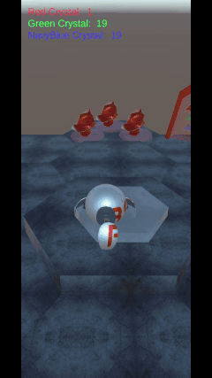
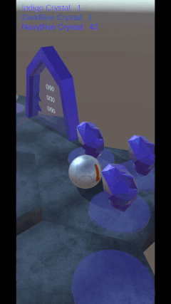
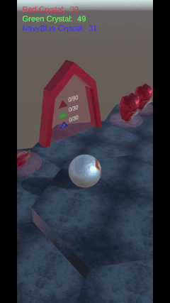

# UnityGamePioneerOfGalacticMiningGuild - Unity3D Mobil Oyun Prototipi

## Herkese Selamlar

Bu proje, Unity ile yaptığım bir **3D Hyper-Casual Mobile Game** deneme projem.

Bu projeyi yapmamdaki amaç; Unity ile 3D Mobile oyun yaparken ki süreci planlayıp, arcade-idle hyper-casual türüne uygun olabilecek mekanikler deneyerek bütün oyun yapım sürecini deneyimlemekti.

Sonuç olarak kendim tasarlayıp ortaya çıkardığım 10 farklı level'ı olan ve bu levellar arasında geçiş yapılabilen bir arcade-idle Hyper-Casual türünde bir 3D mobil oyun prototipi ortaya çıkarttım.

## İçindekiler

0. [Herkese Selamlar](#herkese-selamlar)
1. [Uygulama Hakkında](#uygulama-hakkında)
2. [Görsel Açıklama](#gorsel-aciklama)
3. [Youtube Linki](#youtube-linki)

## Uygulama Hakkında

Oyunun özetle hikayesi. Galactic Mining Guild (GMG) adına çalışan bir öncü droid uzayın bilinmeyen bir yerinde meteorlar taşları arasında gezerek farklı kristallerin örneklerini topluyor.

Oyun içerisindeki amaç, platform üzerindeki kristalleri toplayarak 10 platformun üzerinde bulunan 21 geçidi (Prototip olduğu için 21 geçitte bitirdim.) açmak. Geçitlerin hepsi açıldıktan sonra oyun başa dönüyor ve tekrar başlıyor. 

Tek parmak ile ekrana dokunularak Pioneer Droid'i harekete geçiriliyor. Dokundurulan parmak, ekranda sürüklenerek Pioneer Droid'in ileriye/sağa/sola hareket etmesi sağlanıyor.

Kristal madenlerine gidilerek bu kristallerin toplanması sağlanıyor ve geçitlere gidilerek toplanılan bu madenler geçitlere koyularak diğer platformların açılması sağlanıyor.

## Görsel Açıklama

Karakterin hareketi

Madenlerin toplanışı

Geçitlerin açılışı

## Youtube Linki

Youtube üzerinden paylaştığım uygulama videosuna [bu linkten](https://youtu.be/RnIhRT5WLbA) ulaşabilirsiniz.
